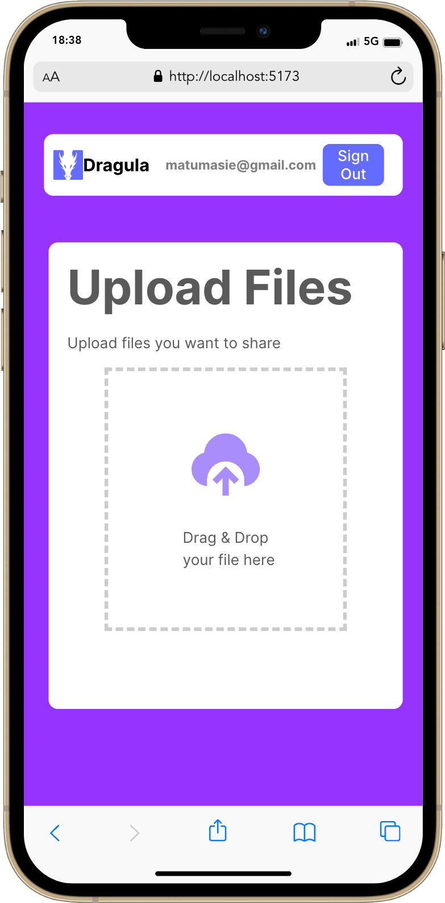

## 📗 Table of Contents

- [📖 About the Project](#about-project)
  - [🛠 Built With](#built-with)
    - [Tech Stack](#tech-stack)
    - [Key Features](#key-features)
  - [🚀 Live Demo](#live-demo)
- [💻 Getting Started](#getting-started)
  - [Setup](#setup)
  - [Prerequisites](#prerequisites)
  - [Install](#install)
  - [Usage](#usage)
- [👥 Authors](#authors)
- [🔭 Future Features](#future-features)
- [🤝 Contributing](#contributing)
- [⭐️ Show your support](#support)
- [🙏 Acknowledgements](#acknowledgements)
- [📝 License](#license)

# 📖 [Dragula] <a name="about-project"></a>

**[Dragula]** is a React Single Page Application designed for file uploads, featuring both sign-in and sign-up functionality through Firebase Authentication. 


## 🛠 Built With <a name="built-with"></a>

### Tech Stack <a name="tech-stack"></a>

<details>
  <summary>Tools</summary>
  <ul>
    <li><a href="https://react.dev/">React</a></li>
  </ul>
  <ul>
    <li><a href="https://reactrouter.com/">React Router</a></li>
  </ul>
  <ul>
    <li><a href="https://firebase.google.com/">Firebase</a></li>
  </ul>
  
</details>


### Key Features <a name="key-features"></a>

- **[Sign Up Using Email]**
- **[Login Using Email]**
- **[Upload files]**
- **[Sign Out]**


<p align="right">(<a href="#readme-top">back to top</a>)</p>

## 💻 Getting Started <a name="getting-started"></a>

### Prerequisites

In order to run this project you need to:
-installed React
-Laptop
-Internet
-Github
-Command Line

### Setup

Clone this repository to your desired folder:

```sh
  cd my-folder
  https://github.com/ctokoli/Dragula.git
```

### Install

Install this project with:

Install Vite [https://vitejs.dev/]

## 🚀 Live Demo <a name="live-demo"></a>

- [Here is the link to the live experience](https://moviebox-a18k.onrender.com/).

> |     | Mobile version                      | Desktop version                      |     |
> | --- | ----------------------------------- | ------------------------------------ | --- |
> |     |  |  |


<p align="right">(<a href="#readme-top">back to top</a>)</p>

## 👥 Author <a name="authors"></a>

👤 **Cephas, Tokoli**

- GitHub: [@Ctokoli](https://github.com/ctokoli/)
- Twitter: [@Ctokoli](https://twitter.com/ctokoli)
- LinkedIn: [Cephas Tokoli](https://www.linkedin.com/in/cephas-tokoli-a25204123/)


<p align="right">(<a href="#readme-top">back to top</a>)</p>

## 🤝 Contributing <a name="contributing"></a>

Contributions, issues, and feature requests are welcome!

Feel free to check the [issues page](../../issues/).

<p align="right">(<a href="#readme-top">back to top</a>)</p>

## ⭐️ Show your support <a name="support"></a>

If you like this project give a star

<p align="right">(<a href="#readme-top">back to top</a>)</p>

## 🙏 Acknowledgments <a name="acknowledgements"></a>

I would like to thank HGNx community and Mentors. 
<p align="right">(<a href="#readme-top">back to top</a>)</p>


## 📝 License <a name="license"></a>

This project is [MIT](./LICENSE) licensed.

<p align="right">(<a href="#readme-top">back to top</a>)</p>
